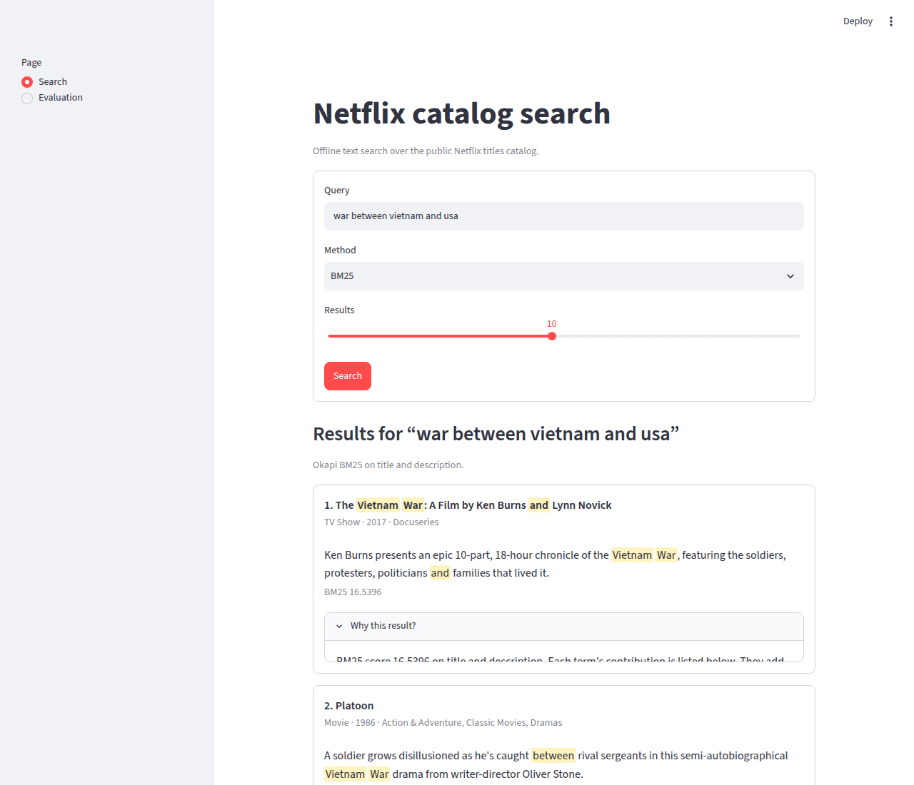

# Netflix Catalog Search

Offline text search over a public Netflix title catalog. The project compares
Boolean retrieval, TF-IDF, BM25, dense embeddings, hybrid reciprocal rank fusion
(RRF), and cross-encoder reranking on one labeled query set.

This is a catalog-search project, not a personalized recommender: it uses title,
description, genre, cast, director, and country metadata (plus an optional
Wikipedia plot ablation), but no viewing history or collaborative-filtering signals.

## What this project demonstrates

- Lexical, semantic, hybrid, and two-stage retrieval in one package
- Metadata-field ablations and explicit first-stage/reranker wiring
- Reproducible Recall, nDCG, and MRR evaluation
- A command-line interface for querying, indexing, and evaluation
- A local UI that explains each result from the model that ranked it
- Model and embedding caches for repeatable local runs
- Unit tests and lightweight CI without model downloads

## Retrieval pipeline

```text
query -> BM25 ------------------+
                                 +-> RRF -> top 50 -> cross-encoder -> results
query -> MiniLM dense retrieval -+
```

Exact names and titles often favor BM25, while dense retrieval handles paraphrases.
RRF combines their rank lists without mixing incompatible raw score scales; the
cross-encoder then spends more compute only on the strongest candidates.

## Results

Metrics come from 28 author-labeled queries with binary relevance judgments. The
committed [`results/eval_metrics.json`](results/eval_metrics.json) is the source of
truth and can be regenerated with `python -m retrieval eval`.

<!-- METRICS_TABLE_BEGIN -->
| method | recall@5 | recall@10 | ndcg@5 | ndcg@10 | mrr |
| --- | --- | --- | --- | --- | --- |
| boolean | 0.3159 | 0.4012 | 0.3185 | 0.3527 | 0.4440 |
| tf-idf | 0.4502 | 0.5446 | 0.4555 | 0.4912 | 0.5013 |
| tf-idf(desc+meta) | 0.4192 | 0.5446 | 0.3875 | 0.4374 | 0.4659 |
| tf-idf(desc+plot) | 0.3639 | 0.4722 | 0.3672 | 0.4038 | 0.4956 |
| bm25 | 0.5248 | 0.5645 | 0.5167 | 0.5253 | 0.5637 |
| bm25(desc+meta) | 0.5020 | 0.5524 | 0.5233 | 0.5353 | 0.6002 |
| bm25(desc+plot) | 0.5069 | 0.6116 | 0.5093 | 0.5494 | 0.5972 |
| dense(title+desc) | 0.5849 | 0.6209 | 0.5710 | 0.5656 | 0.6304 |
| dense(title+desc+meta) | 0.5735 | 0.6856 | 0.5825 | 0.6193 | 0.6786 |
| dense(title+desc+plot) | 0.5569 | 0.6506 | 0.5524 | 0.5738 | 0.6376 |
| dense(title-only) | 0.4241 | 0.4499 | 0.4286 | 0.4269 | 0.5081 |
| hybrid(tfidf+dense) | 0.5059 | 0.6922 | 0.4941 | 0.5626 | 0.5853 |
| hybrid(bm25+dense,meta) | 0.6552 | 0.7421 | 0.6351 | 0.6605 | 0.7065 |
| dense+rerank | 0.6167 | 0.7062 | 0.6179 | 0.6469 | 0.6930 |
| hybrid+rerank | 0.7001 | 0.7817 | 0.6958 | 0.7185 | 0.7583 |
<!-- METRICS_TABLE_END -->

`hybrid+rerank` means cross-encoder reranking over
`hybrid(bm25+dense,meta)`. Full method notes, qualitative examples, and failure
analysis are in [`RETRIEVAL.md`](RETRIEVAL.md).

## Quick start

```bash
git clone https://github.com/NikosMav/netflix-catalog-search.git
cd netflix-catalog-search
python -m venv .venv
source .venv/bin/activate          # Windows: .venv\Scripts\activate
pip install -e ".[dev]"

python -m retrieval query "war between vietnam and usa" --method bm25 --top-k 10
python -m retrieval query "feel-good cooking competition show" --method hybrid-rerank
pytest
```

The BM25, Boolean, and TF-IDF paths need no model download. The first dense or
reranked query downloads the MiniLM bi-encoder and MS MARCO cross-encoder and
caches catalog embeddings under `.cache/`.

## Run the UI

```bash
pip install -e ".[ui]"
streamlit run app/streamlit_app.py
```



The app is a search page and an evaluation page. Search runs BM25, dense MiniLM,
hybrid RRF, or hybrid plus cross-encoder rerank (the default). Open "Why this
result?" on a hit for the score breakdown from that method. Evaluation reads the
committed [`results/eval_metrics.json`](results/eval_metrics.json) and does not
recompute it.

The first dense or reranked search downloads the MiniLM models and caches
embeddings under `.cache/`. Later runs stay on CPU.

Precompute all dense indexes or regenerate evaluation artifacts:

```bash
python -m retrieval index
python -m retrieval eval --failures
python scripts/sync_metrics_docs.py
```

Wikipedia plot enrichment is already committed under `data/wikipedia_plots.jsonl`
(CC BY-SA). To regenerate from the MediaWiki API:

```bash
pip install -e ".[enrich]"
python scripts/enrich_wikipedia_plots.py
```

Install the full exploratory-notebook stack with `pip install -r requirements.txt`.

## Repository map

| Path | Purpose |
| --- | --- |
| `retrieval/` | Catalog loading, retrievers, reranker, metrics, and CLI |
| `retrieval/explain.py` | Score explanations used by the UI |
| `app/streamlit_app.py` | Local search and evaluation UI |
| `tests/` | Fast unit and wiring tests |
| `data/labeled_queries.json` | Evaluation queries and relevant show IDs |
| `data/wikipedia_plots.jsonl` | Wikipedia plot enrichment (CC BY-SA) |
| `results/` | Metrics and qualitative comparisons |
| `RETRIEVAL.md` | Detailed retrieval case study |
| `netflix_data_analysis.ipynb` | Original EDA and sparse-retrieval chapter |
| `netflix_dense_retrieval.ipynb` | Short package walkthrough |

## Evaluation boundaries

- The 28 queries and relevance judgments were created by the project author.
- Labels are binary and have no inter-annotator agreement or confidence intervals.
- Results describe this fixed catalog snapshot, query set, and model configuration.
- Full model evaluation is intentionally separate from lightweight CI.

## How this was built

This project was built with AI coding agents (Cursor cloud agents) working from a staged plan. Nikos Mavrapidis designed the plan and the evaluation, reviewed each change before merge with AI assistance, and checked the reported results against the committed metrics and CI.

## Data and license

The catalog is the public Netflix Movies and TV Shows dataset distributed by
[Shivam Bansal on Kaggle](https://www.kaggle.com/shivamb/netflix-shows) and mirrored
by [TidyTuesday](https://github.com/rfordatascience/tidytuesday/tree/master/data/2021/2021-04-20).
Provenance and IMDb-join caveats are documented in [`data/README.md`](data/README.md).

Code is released under the [MIT License](LICENSE). Netflix catalog content remains
the property of Netflix; IMDb-derived data is subject to IMDb's non-commercial terms.
Wikipedia plot text in [`data/wikipedia_plots.jsonl`](data/wikipedia_plots.jsonl) is
[CC BY-SA 4.0](data/WIKIPEDIA_ATTRIBUTION.md).
The CC BY-SA attribution note for those excerpts is in [`data/README.md`](data/README.md).
